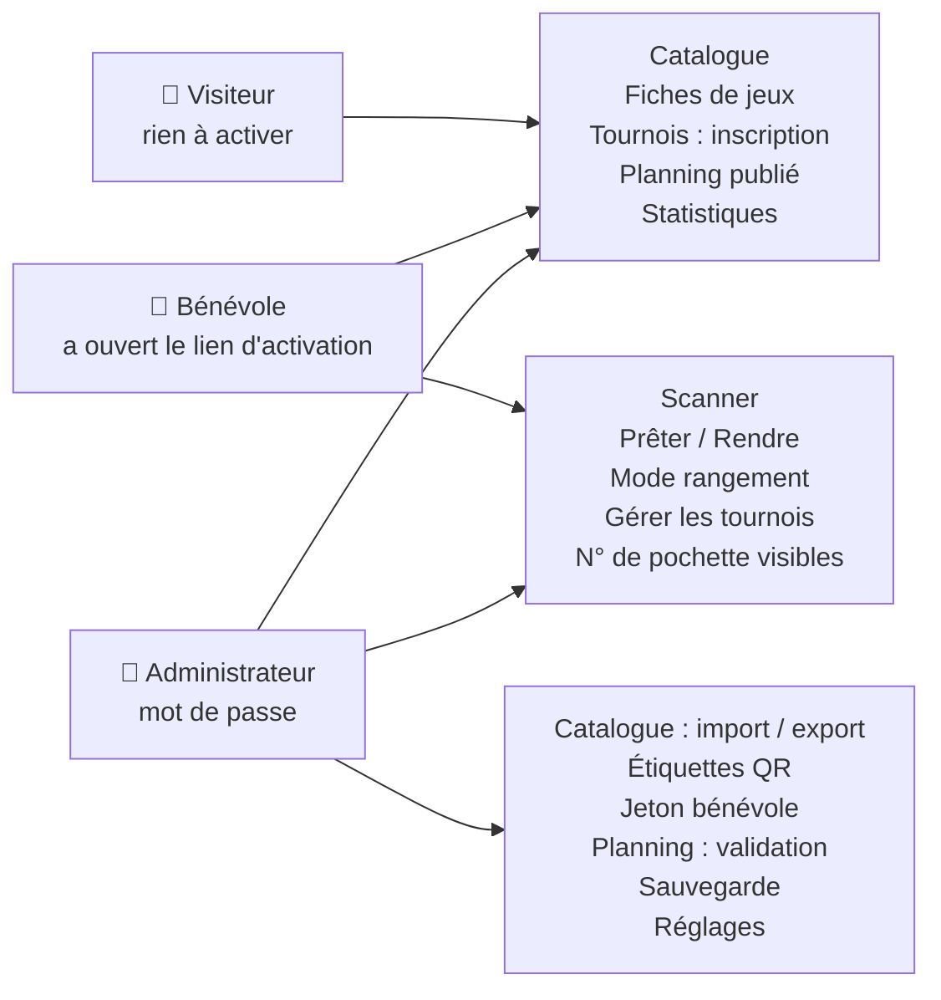
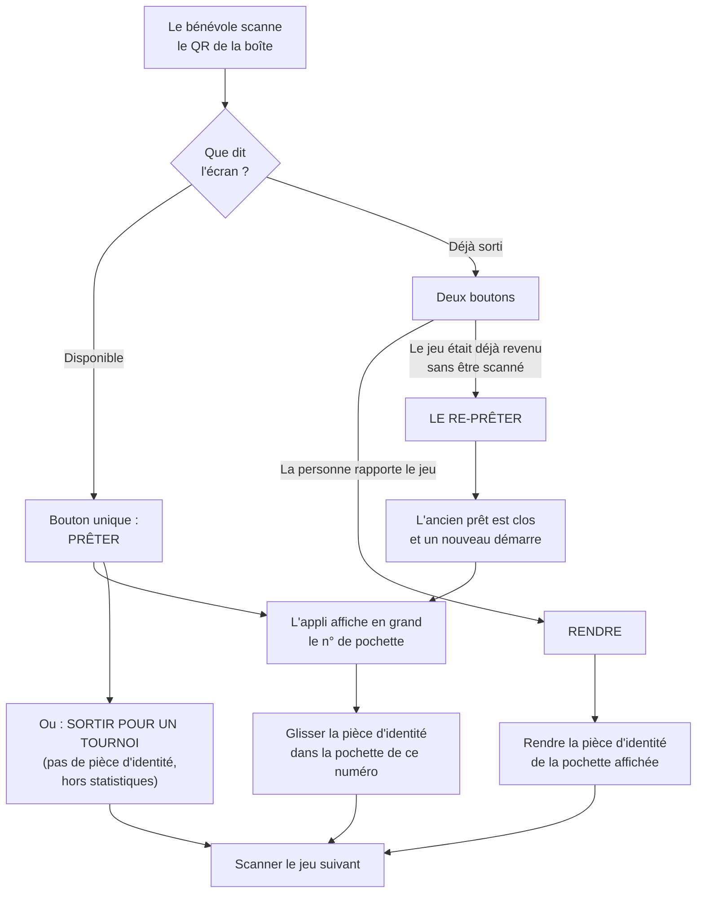
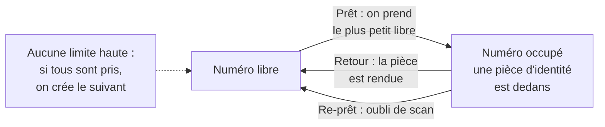
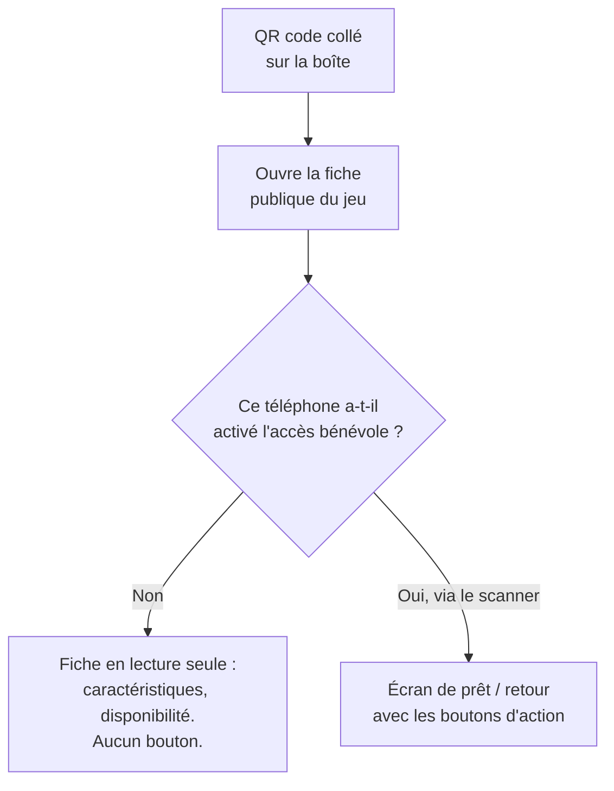
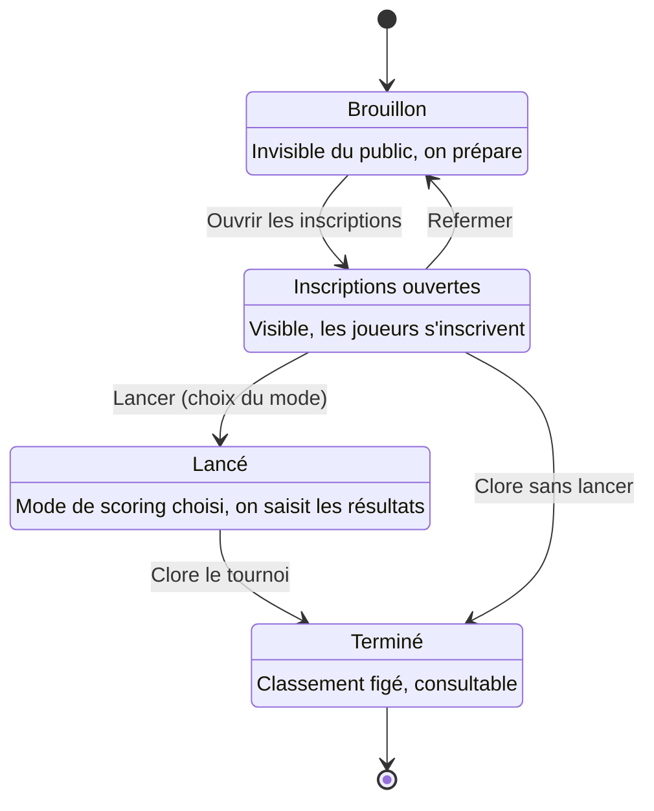
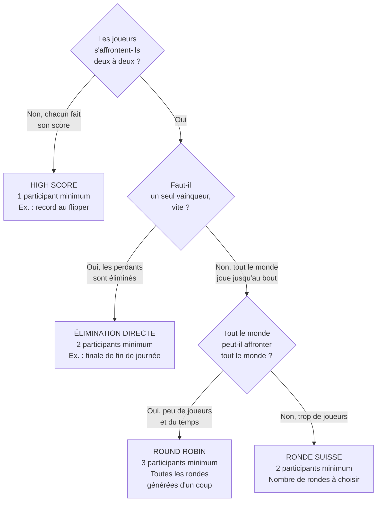
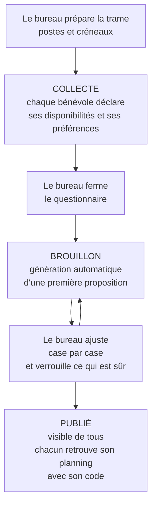
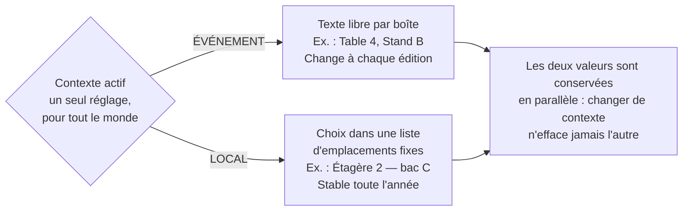
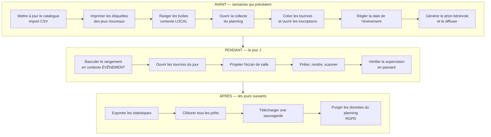

# Guide utilisateur LudoteX — cadrage et plan de travail

**Date** : 2026-07-18 · **Statut** : cadrage arbitré, prêt pour la rédaction

**Décisions (Simon, 2026-07-18)** — toutes prises, aucune question ouverte :

- le guide utilisateur n'est **pas** un nouveau document : c'est une **refonte
  du wiki existant** (`wiki/`), qui devient LA référence utilisateur unique ;
- les diagrammes sont en **Mermaid**, directement dans le markdown ;
- le wiki **reste dans le dépôt** ;
- les captures sont prises sur une **instance locale peuplée**, sans le mode
  formation ;
- une **fiche A4 recto** est extraite du guide bénévole pour le jour J ;
- **infinitif pour les gestes, « vous » pour le reste.**

Récapitulatif et justifications au §9.

Ce document ne rédige pas le guide : il pose le diagnostic, les principes, le
plan chapitre par chapitre, les diagrammes prêts à coller et la liste précise
des captures d'écran à réaliser. Il se lit avant d'écrire une ligne du guide.

---

## 1. Pourquoi refondre plutôt que créer

Le dépôt contient déjà **trois systèmes d'aide** qui se sont empilés :

| Système | Où | Public | État |
|---|---|---|---|
| Le wiki `wiki/` (14 pages, ~1 500 lignes) | GitHub | bénévole, bureau, développeur | Bon, mais 100 % texte et partiellement périmé |
| Quatre pages d'aide **dans** l'application | `/aide`, `/tournoi/aide`, `/planning/aide`, `/rangement/aide` | utilisateur en situation | Bonnes individuellement, sans index (cf. audit §B2) |
| Les docs de conception `docs/` | GitHub | développeur / IA | Excellentes, mais illisibles pour un non-développeur |

Ajouter un quatrième document créerait une quatrième source de vérité à
maintenir. La bonne réponse est de **faire du wiki le guide utilisateur**, en
le complétant de ce qui lui manque vraiment.

### Ce que le wiki fait déjà bien — à préserver

Il ne s'agit pas de réécrire pour réécrire. Ces qualités du wiki actuel sont
acquises et doivent survivre à la refonte :

- **le ton est déjà juste** : phrases courtes, aucun jargon technique gratuit,
  explications par le concret (« glisser la pièce d'identité dans la
  pochette ») ;
- **les explications « pourquoi » sont là** : la section de `Guide-Admin.md`
  qui explique pourquoi le bloc Sauvegarde dit souvent « aucune sauvegarde
  trouvée » est un modèle du genre — elle anticipe une inquiétude réelle et la
  désamorce ;
- **le maillage entre pages fonctionne** : chaque page a sa section « Voir
  aussi » ;
- **la séparation par module** correspond à la réalité de l'application.

### Les six manques réels

1. **Aucun diagramme, aucune image, nulle part.** 1 500 lignes de prose pour
   décrire une application dont le cœur est un *geste* (scanner, regarder,
   appuyer). C'est le manque n°1, et c'est l'objet principal de ce document.
2. **Le module Rangement est totalement absent du wiki.** Vérifié : zéro
   occurrence du mot dans `wiki/`. C'est pourtant une fonctionnalité complète
   et livrée (deux contextes, mode scanner dédié, page des manques, affectation
   en lot, `/rangement/aide` in-app). Un bureau qui lit le wiki ignore
   l'existence de la moitié du travail de rangement.
3. **Plusieurs pages sont périmées** — l'application a avancé plus vite que le
   wiki. Repéré, avec les emplacements exacts pour rendre la correction
   mécanique :
   - le menu « Base de données » s'appelle désormais « Données & sauvegarde »
     (`/admin/donnees`, les deux menus ont été fusionnés) →
     `Guide-Admin.md:18` et `FAQ.md:10` ;
   - la section « Écran de salle » ne mentionne pas les **annonces libres** ni
     leur durée d'affichage (livrées depuis) ;
   - le **mode formation** (site bis d'entraînement) n'apparaît nulle part
     comme fonctionnalité utilisable, alors qu'il est fait pour les bénévoles ;
   - ~~« les trois modes de scoring » : il y en a **quatre** (round robin a
     été ajouté), plus les **tournois par équipes**~~ → **✅ CORRIGÉ
     (2026-07-18)**. Ce n'était pas qu'un nombre à changer : **round robin
     était absent du wiki en totalité**, et les **tournois par équipes**
     aussi. Deux sections ajoutées à `Module-Tournois.md` (mode round robin
     — rondes toutes générées au lancement, minimum 3 participants, tableau
     des confrontations ; et tournois par équipes — une équipe = un
     participant, un code pour toute l'équipe, membres non publics), plus le
     comptage corrigé dans `Home.md`. **Défaut voisin trouvé au passage et
     corrigé** : la section BO3 disait « ronde suisse et élimination
     directe » alors que `lancer_tournoi` l'accepte aussi pour le round
     robin. ⚠️ **Le même oubli subsiste DANS L'APPLICATION** — voir le point
     ouvert ci-dessous ;
   - la **saisie manuelle de secours** au scanner (taper le code quand le QR
     est illisible) n'est pas documentée — or c'est exactement le geste qu'on
     cherche dans un guide quand ça se passe mal ;
   - la FAQ affirme que l'e-mail à l'inscription à un tournoi « ne sert qu'à
     recevoir le code » : en phase 1 le champ n'est **pas utilisé du tout** et
     rien n'est envoyé. À corriger, c'est une promesse non tenue.

   > **Point ouvert, côté APPLICATION cette fois** (relevé le 2026-07-18 en
   > corrigeant le wiki) : deux chaînes affichées annoncent le BO3 comme
   > réservé à la ronde suisse et à l'élimination directe, alors que
   > `tournoi/services.py::lancer_tournoi` l'accepte aussi pour le **round
   > robin** — `app/templates/tournoi_gerer.html` (petit texte de la case
   > « Best of 3 ») et `app/templates/tournoi_aide.html` (« Pour la ronde
   > suisse et l'élimination, vous pouvez aussi cocher… »). L'omission était
   > déjà signalée dans `CLAUDE.md` au moment de la fiche M5, sans être
   > corrigée. Le wiki dit désormais vrai ; **l'écran, lui, sous-vend encore
   > une option qui marche** — un bénévole qui lance un championnat ne pense
   > pas à cocher BO3. Correctif à faire côté application (2 chaînes + le
   > test M5, qui asserte le texte de la notice).

4. **Rien sur « quand ».** Le wiki explique parfaitement *comment* faire chaque
   chose, jamais *dans quel ordre* ni *à quel moment de l'année*. Le bureau qui
   prépare l'édition n'a aucune ligne de conduite. L'audit UX relève le même
   manque côté application (fiche C2, « pas de checklist avant l'événement »).
5. **Pas de page d'entrée par le besoin.** Le sommaire est organisé par
   *module* (logique de concepteur), pas par *question* (logique
   d'utilisateur). Personne ne se demande « je voudrais du Module-Pret » ; on se
   demande « comment je fais si le QR ne marche pas ».
6. **Aucun glossaire.** Or le vocabulaire est le point faible connu du produit :
   l'audit UX (fiche D3) établit que le mot « emplacement » désigne
   aujourd'hui **trois objets différents** selon l'écran.

---

## 2. Pour qui l'on écrit

Trois lecteurs, trois besoins, trois moments. Chaque page du guide doit savoir
lequel des trois elle sert — et le dire dès sa première ligne.

### Le bénévole du jour J

Debout, derrière une table, avec son téléphone dans une main et une boîte de
jeu dans l'autre. Du bruit, la queue, il n'a jamais utilisé l'appli ou l'a
utilisée l'an dernier une fois. **Il ne lira pas le guide** — il le
*consultera*, dix secondes, quand quelque chose cloche.

*Conséquence rédactionnelle* : ce qui le concerne doit tenir sur **un écran de
téléphone**, être trouvable par le titre, et commencer par le cas normal. La
version longue est ailleurs.

### Le membre du bureau

Assis, chez lui, quelques semaines avant l'événement ou le soir même. Il
prépare, il vérifie, il répare. Il n'est pas développeur mais il est prêt à
lire. Il a besoin de comprendre les **conséquences** de ses actions (« si je
réinitialise le jeton, qu'est-ce qui casse ? »).

*Conséquence rédactionnelle* : il a droit au « pourquoi », aux mises en garde,
aux ordres d'opérations. C'est le seul des trois qui lira un chapitre entier.

### Le visiteur / joueur

Il consulte le catalogue, s'inscrit à un tournoi, cherche son code de
désinscription. Il ne saura probablement jamais que ce wiki existe — mais les
pages qui le concernent doivent pouvoir lui être **envoyées en lien** par un
bénévole.

*Conséquence rédactionnelle* : ces pages doivent être autonomes, sans supposer
qu'on a lu le reste, et ne jamais afficher d'écran bénévole.

---

## 3. Principes rédactionnels (à appliquer partout)

Ces règles valent aussi bien pour le wiki que, à terme, pour les pages d'aide
intégrées à l'application — elles doivent parler le même langage.

### Écriture

1. **Un titre = une question de l'utilisateur.** Préférer « Le QR ne se scanne
   pas » à « Dépannage du module de capture ». Le titre est le seul élément lu
   à coup sûr.
2. **Le cas normal d'abord, l'exception ensuite.** Jamais l'inverse. Un bénévole
   qui cherche « comment prêter » ne doit pas traverser trois paragraphes sur
   le re-prêt.
3. **Infinitif pour les gestes, « vous » pour le reste.** ✅ *Arbitré
   (2026-07-18).* Les instructions restent à l'infinitif — « Ouvrir le menu »,
   « Appuyer sur **Prêter** » — ce qui préserve la sobriété du wiki actuel et
   évite d'avoir à réécrire 1 500 lignes. Mais dès qu'on s'adresse à la
   personne, on la vouvoie : « si vous avez oublié de scanner un retour », « le
   code que vous avez reçu ». L'infinitif intégral devenait contorsionné dans la
   FAQ, qui est par nature une question posée à la première personne. Pas de
   tutoiement : le guide sert aussi des pages grand public (catalogue,
   inscription à un tournoi).
4. **Nommer les boutons exactement comme à l'écran**, en gras, sans les
   reformuler. Si le guide dit « Valider » et que l'écran dit « Enregistrer »,
   le guide a tort — et c'est le guide qu'on croira responsable de la confusion.
5. **Pas de chemin technique dans le corps du texte.** Écrire « depuis le menu
   Administration → Données & sauvegarde », et mettre l'URL entre parenthèses
   seulement si elle est utile à taper (`/admin/donnees`).
6. **Zéro jargon non traduit.** Interdits sauf définition immédiate : jeton
   (dire « lien d'activation » et expliquer une fois), instance, base de
   données (dire « les données de l'application »), migration, cookie (dire
   « le téléphone s'en souvient »).
7. **Toute mise en garde dit sa conséquence concrète.** Pas « attention, action
   irréversible » mais « les numéros de pochette seront tous libérés : les
   pièces d'identité encore en pochette ne seront plus rattachées à un jeu ».
8. **Aucune phrase au conditionnel sur ce que fait le logiciel.** Il fait ou il
   ne fait pas. Le conditionnel est réservé aux choix de l'utilisateur.

### Structure de page

Chaque page du guide suit le même squelette :

```
# Titre

Une phrase : à qui s'adresse cette page et à quel moment.

[Diagramme d'ensemble, si la page en a un]

## En bref (3–5 puces)     ← ce que 80 % des lecteurs liront

## Section par tâche
   ### La tâche
   [capture d'écran]
   1. Étape
   2. Étape
   > Mise en garde éventuelle

## Si ça ne marche pas     ← systématique, jamais optionnel

## Voir aussi
```

La section **« Si ça ne marche pas »** est obligatoire sur toute page décrivant
une action. C'est elle qui incarne le principe fondateur du produit — *ne jamais
bloquer* — dans la documentation.

### Ce qui ne va PAS dans le guide utilisateur

À laisser dans `docs/` et `wiki/Contribuer.md` / `wiki/Deploiement.md` :
noms de fichiers Python, noms de tables ou de colonnes, extraits de code,
commandes shell (sauf la page Déploiement, assumée technique), nombre de tests,
historique des décisions de conception.

---

## 4. Architecture proposée du wiki refondu

De 14 pages à plat vers 4 familles. Les URL de page (noms de fichiers) sont
conservées quand elles existent déjà, pour ne pas casser les liens externes.

```
Home.md ......................... Porte d'entrée, réorganisée « par besoin »
Glossaire.md .................... 🆕 Les 12 mots du produit
Avant-pendant-apres.md .......... 🆕 La ligne de vie d'une édition

PRISE EN MAIN
  Guide-Benevole.md ............. Refondu, raccourci, illustré
  Guide-Admin.md ................ Refondu, corrigé, découpé
  FAQ.md ........................ Corrigée et enrichie

LES MODULES
  Module-Pret.md ................ + saisie manuelle de secours
  Module-Tournois.md ............ + 4ᵉ mode, équipes, .ics
  Module-Planning.md ............ inchangé pour l'essentiel
  Module-Rangement.md ........... 🆕 (manque total aujourd'hui)
  Module-Ecran-Salle.md ......... + annonces libres et durée
  Module-Statistiques.md ........ + cloisonnement du n° de pochette

COMPRENDRE
  Acces-et-Token.md ............. Renommé « Qui voit quoi »
  Fonctionnalites.md ............ Conservé
  Mode-Formation.md ............. 🆕 s'entraîner sans risque
  Rgpd.md ....................... Conservé

TECHNIQUE (inchangé, public développeur assumé)
  Deploiement.md · Contribuer.md

HORS WIKI
  fiche-jour-j.pdf .............. 🆕 A4 recto, extraite du guide bénévole (§7 bis)
```

Le wiki **reste dans le dépôt `wiki/`** (décision du 2026-07-18) : c'est ce qui
permet de corriger une page dans la même Pull Request que le code qui la
périme — voir §9 pour la convention qui va avec.

### Les trois pages nouvelles, en une ligne chacune

- **`Glossaire.md`** — pochette, exemplaire, titre, jeton, contexte de
  rangement, mode formation, brouillon… Une définition, un synonyme à ne pas
  employer, un renvoi. ⚠️ **À écrire après l'arbitrage du mot « emplacement »**
  (audit fiche D3) : figer un vocabulaire ambigu dans un glossaire le
  pérenniserait.
- **`Avant-pendant-apres.md`** — la page qui manque le plus au bureau. Trois
  colonnes, une checklist par phase, chaque ligne renvoyant vers la page qui
  détaille. Elle recoupe la fiche C2 de l'audit UX : si cette checklist est un
  jour intégrée à l'application, **cette page en devient la source** — l'écrire
  en ayant cette réutilisation en tête.
- **`Module-Rangement.md`** — le module est livré, documenté nulle part côté
  utilisateur (hors `/rangement/aide` in-app). Source de départ :
  `docs/conception-rangement.md` + la page d'aide existante, à retraduire.

### Home.md : passer d'un sommaire par module à une entrée par besoin

Le sommaire actuel est un plan de l'application. Le remplacer par un tableau du
type :

| Je veux… | Aller à |
|---|---|
| prêter ou rendre un jeu | Guide bénévole |
| préparer l'événement | Avant / pendant / après |
| régler un problème maintenant | FAQ |
| comprendre un mot | Glossaire |
| organiser un tournoi | Module Tournois |
| savoir où ranger les boîtes | Module Rangement |

Le plan par module reste dessous, en second rideau.

---

## 5. Les diagrammes

Neuf diagrammes couvrent l'essentiel. Ils sont écrits en **Mermaid**, rendu
nativement par GitHub, versionnables et modifiables sans outil.

**Convention** : un diagramme, un identifiant (`D1`…`D9`), placé en haut de la
page qu'il illustre, précédé d'une phrase qui dit ce qu'on doit y voir. Un
diagramme qui a besoin d'être expliqué a échoué — mais un diagramme sans phrase
d'introduction est ignoré.

Les codes ci-dessous sont **prêts à coller** ; D2 et D5 ont été validés au
rendu.

### D1 — Qui voit quoi (page *Acces-et-Token.md* / *Home.md*)

Le diagramme le plus important du guide : il désamorce la confusion n°1 du
produit, entre le **lien d'activation bénévole** et le **mot de passe
administrateur**.



> Message à faire passer en légende : les deux accès sont **indépendants**. Un
> administrateur connecté peut tout faire sans avoir activé le lien bénévole ;
> un bénévole n'obtient jamais l'administration en activant son lien.

### D2 — Le geste du prêt (page *Guide-Benevole.md*) ✅ validé

Le diagramme central du guide. Il doit tenir sur un écran de téléphone en
mode portrait — c'est la contrainte de mise en page prioritaire.



### D3 — La vie d'un numéro de pochette (page *Module-Pret.md*)

Répond à la question posée chaque année : « pourquoi le n°7 revient alors qu'on
en est au 84ᵉ prêt ? »



### D4 — Où mène un QR code (page *Module-Pret.md*)

Explique pourquoi le même autocollant ne donne pas la même chose selon le
téléphone — source de confusion récurrente entre bénévoles.



> À préciser sous le diagramme : c'est en passant par le **scanner de
> l'application** que le bénévole arrive directement sur l'écran d'action.
> L'appareil photo natif du téléphone, lui, ouvre la fiche publique — d'où
> l'impression que « le QR ne marche pas ».

### D5 — La vie d'un tournoi (page *Module-Tournois.md*) ✅ validé



> Point à souligner : le choix du mode de scoring se fait **au lancement**, pas
> à la création — et il ne se change plus après. C'est le seul point de
> non-retour du module.

### D6 — Choisir un mode de scoring (page *Module-Tournois.md*)

Un arbre de décision vaut mieux que quatre paragraphes descriptifs. Les seuils
indiqués sont ceux réellement appliqués par l'application.



> Encadré à ajouter : **les tournois par équipes** ne sont pas un cinquième
> mode. Une équipe compte comme un participant : les quatre modes ci-dessus
> fonctionnent à l'identique.

### D7 — Le cycle du planning bénévole (page *Module-Planning.md*)



> À dire en une phrase sous le diagramme : la génération automatique **laisse
> volontairement des trous**. Elle ne place jamais quelqu'un contre une
> contrainte déclarée — un trou rouge est une information, pas une panne.

### D8 — Les deux contextes de rangement (page *Module-Rangement.md*)



### D9 — La ligne de vie d'une édition (page *Avant-pendant-apres.md*)

Le diagramme le plus utile au bureau, et celui qui n'existe nulle part
aujourd'hui.



> ⚠️ Ordre à respecter et à écrire explicitement : **exporter les statistiques
> AVANT de clôturer** si l'on veut un export figé de l'édition, et **purger le
> planning APRÈS** en avoir tiré ce dont on a besoin — c'est la seule opération
> du produit qui détruit vraiment des données.

### Diagrammes écartés, et pourquoi

- *Schéma de la base de données* — intéressant pour un développeur, sans usage
  pour un bénévole. Il a sa place dans `docs/specification.md`, pas ici.
- *Arborescence complète des URL* — la liste des ~110 routes serait illisible.
  D1 (qui voit quoi) répond au vrai besoin sous-jacent.
- *Diagramme de séquence des appels HTTP* — hors sujet pour ce public.

---

## 6. Le plan de captures d'écran

Les captures sont à réaliser par Simon : elles supposent une application en
fonctionnement avec des données réalistes, ce que la rédaction du guide ne peut
pas produire seule.

### Où les prendre — instance locale peuplée ✅ arbitré

**Décision (2026-07-18) : une instance locale peuplée des données fictives,
sans `MODE_FORMATION`.** Le site de formation aurait été plus rapide, mais son
filigrane « FORMATION » traverse chaque page en diagonale et ne se recadre pas :
le guide en porterait la marque à vie.

Faisabilité vérifiée : `app/formation.py` n'a **aucune garde** sur
`MODE_FORMATION` (la garde est sur le bouton admin, pas sur le module). Lancé
en ligne de commande, il peuple simplement les bases vers lesquelles pointe le
`.env` courant. La recette :

```bash
cp .env .env.reel                    # mettre le .env de travail de côté
# dans .env : chemins de bases dédiés, et surtout MODE_FORMATION absent ou =0
#   DATABASE_PATH=data/captures-pret.db
#   TOURNOI_DATABASE_PATH=data/captures-tournoi.db
#   PLANNING_DATABASE_PATH=data/planning.db   (à dédier aussi si besoin)
python -m app.db                     # initialise les bases
python -m app.formation              # 20 jeux, 10 prêts, 1 tournoi
python -m app.planning.demo          # pour les captures 24 et 25
uvicorn app.main:app --reload
```

Le script étant **idempotent au sens fort** (il vide puis repeuple), le même
jeu de données est reproductible à l'identique dans deux ans pour refaire une
capture isolée sans que le reste du guide ne dénote. Conserver le `.env` de
captures dans un coin, hors dépôt — c'est lui la vraie garantie de
reproductibilité.

> Deux captures échappent à cette recette et demandent une préparation
> manuelle : la **n°9** (bandeau mode rangement, à activer au scanner) et la
> **n°26** (écran de salle avec une annonce, à saisir depuis
> `/admin/ecran-salle`).

### Conventions

| Point | Règle |
|---|---|
| **Dossier** | `wiki/images/` |
| **Nom de fichier** | `<page>-<sujet>.png`, en minuscules sans accent — ex. `benevole-ecran-pret-disponible.png` |
| **Format** | PNG. Largeur max 900 px pour les captures d'ordinateur, 400 px pour les captures de téléphone |
| **Appareil** | Écrans bénévole → **téléphone en portrait** (c'est le vrai usage). Écrans admin → **ordinateur**, fenêtre ~1200 px de large (le tableau de bord passe en deux colonnes au-delà de 900 px) |
| **Texte alternatif** | Toujours rempli et descriptif : `` |
| **Annotations** | Cadre rouge fin (2 px) uniquement, jamais de flèche ni de texte incrusté — un texte incrusté ne se traduit pas et périme la capture |
| **Interdits absolus** | ⚠️ aucun **numéro de pochette réel**, aucun **nom de bénévole**, aucun **pseudo de joueur réel**, aucun **jeton visible en entier** dans l'URL ou à l'écran |

> Le point « numéro de pochette » n'est pas cosmétique : c'est une contrainte de
> sécurité du produit (le numéro est rattaché à une pièce d'identité). Elle a
> déjà motivé son retrait de l'écran de salle et, tout récemment, des
> statistiques publiques. Les captures doivent la respecter au même titre que
> les écrans.

### Liste des captures (26)

Priorité : 🔴 indispensable · 🟠 utile · 🟡 confort.

#### Guide bénévole (téléphone, portrait)

| # | Écran / URL | État à préparer | Prio |
|---|---|---|---|
| 1 | Page d'activation après ouverture du lien (`/acces?jeton=…`) | Recadrer pour **masquer le jeton** dans l'URL | 🔴 |
| 2 | `/scanner`, caméra active | Viser un QR — flouter l'arrière-plan si nécessaire | 🔴 |
| 3 | `/pret/<id>` — jeu **disponible** | Montre le bouton **Prêter** seul | 🔴 |
| 4 | `/pret/<id>` — résultat après prêt | Le numéro de pochette en grand (numéro fictif) | 🔴 |
| 5 | `/pret/<id>` — jeu **déjà sorti** | Les deux boutons Rendre / Le re-prêter | 🔴 |
| 6 | `/pret/<id>` — résultat après retour | Bandeau vert + emplacement en grand | 🟠 |
| 7 | Formulaire de **saisie manuelle** sous le scanner | Panneau visible, champ vide | 🟠 |
| 8 | Menu du bandeau **déplié** sur téléphone | Le menu bénévole en accordéon | 🟠 |
| 9 | Bandeau **mode rangement** actif | Nécessite d'activer le mode au scanner | 🟡 |

#### Catalogue et public

| # | Écran / URL | État à préparer | Prio |
|---|---|---|---|
| 10 | `/catalogue` avec un filtre posé | Montrer les **puces de filtres actifs** | 🔴 |
| 11 | `/jeu/<id>` — fiche publique | Vue **visiteur**, sans bouton d'action | 🟠 |
| 12 | `/` page d'accueil | Avec la frise de planning des tournois visible | 🟠 |

#### Administration (ordinateur, ~1200 px)

| # | Écran / URL | État à préparer | Prio |
|---|---|---|---|
| 13 | `/admin` tableau de bord, deux colonnes | Vue d'ensemble, supervision à droite | 🔴 |
| 14 | `/admin/jeton` | ⚠️ **masquer le jeton réel** au recadrage ou au flou | 🔴 |
| 15 | `/admin/donnees` | Les deux blocs : catalogue et sauvegarde | 🔴 |
| 16 | `/admin/etiquettes` | Quelques jeux cochés, réglages de planche visibles | 🟠 |
| 17 | Une planche d'étiquettes générée (PDF) | Extrait de 4 étiquettes | 🟠 |
| 18 | `/admin/supervision` | Idéalement avec les 5 blocs au vert | 🟠 |
| 19 | `/admin/rangement` | Contexte actif + liste d'emplacements | 🔴 |
| 20 | `/admin/rangement/ranger` | Vue par titre, quelques jeux cochés | 🟠 |
| 21 | `/admin/fonctionnalites` | Les quatre états dans les listes déroulantes | 🟡 |

#### Modules

| # | Écran / URL | État à préparer | Prio |
|---|---|---|---|
| 22 | `/tournoi/<id>/gerer` | Tournoi en inscriptions, quelques inscrits | 🔴 |
| 23 | `/tournoi/<id>` public avec classement | Tournoi lancé, quelques scores saisis | 🟠 |
| 24 | `/planning/admin/<ev>` — la grille | **Avec des trous rouges visibles** : c'est le cas à expliquer | 🔴 |
| 25 | `/planning/collecte/<ev>` | Formulaire de souhaits, préférences visibles | 🟠 |
| 26 | `/live` écran de salle | **Avec une annonce affichée** dans le bandeau | 🟠 |

### Deux règles de survie pour les captures

1. **Une capture par concept, pas une par écran.** La tentation est d'illustrer
   les 55 écrans. Vingt-six captures bien choisies valent mieux, et surtout se
   maintiennent : chaque capture est une dette, elle périme au premier changement
   de style.
2. **Ne jamais capturer un écran qu'on peut décrire en une phrase.** Un
   formulaire à deux champs n'a pas besoin d'image. Réserver les captures aux
   écrans où **le repérage visuel est le problème** (où est le bouton, à quoi
   ressemble un trou dans la grille, quelle couleur signifie quoi).

---

## 7. Articulation avec les chantiers déjà identifiés

Trois fiches de `docs/audit-ux-2026-07-18.md` recoupent directement ce travail.
Les traiter ensemble évite d'écrire deux fois la même chose.

| Fiche | Sujet | Lien avec le guide |
|---|---|---|
| **B2** | Quatre pages d'aide, aucun index | L'index d'aide in-app doit **pointer vers le wiki** pour le détail. Écrire les deux avec le même vocabulaire, dans la même session si possible. |
| **C1** | Aucune aide côté administration | Les textes d'aide admin à écrire sont des **extraits du `Guide-Admin.md` refondu**. Rédiger le guide d'abord, en extraire les blocs ensuite. |
| **C2** | Pas de checklist « avant l'événement » | `Avant-pendant-apres.md` **est** cette checklist. L'écrire en markdown structuré pour qu'elle puisse être portée telle quelle dans l'application. |
| **D3** | Le mot « emplacement » désigne trois choses | 🚧 **Bloquant pour le glossaire.** À trancher avant d'écrire `Glossaire.md`. |

---

## 8. Ordre de travail suggéré

Chaque étape produit quelque chose d'utile même si la suivante attend.

1. **Corriger le périmé** (½ journée) — les six points périmés du §1, dont les
   emplacements exacts sont donnés. Rapide, à fort rendement : un guide faux
   est pire qu'un guide incomplet.
2. **Écrire `Module-Rangement.md`** — le seul trou fonctionnel complet.
3. **Insérer les neuf diagrammes** — aucune capture requise, effet immédiat.
4. **Écrire `Avant-pendant-apres.md`** — la page la plus attendue par le bureau.
5. **Monter l'instance de captures** (recette du §6), puis réaliser les
   **10 captures 🔴** seulement.
6. **Refondre `Home.md`** en entrée par besoin, une fois qu'il y a de quoi
   pointer.
7. **Produire la fiche A4** (§7 bis) — une fois D2 et la capture n°4 en main.
8. **Écrire `Glossaire.md`** — *après* l'arbitrage D3.
9. **Compléter par les captures 🟠 puis 🟡**, au fil de l'eau.

Les étapes 1 à 4 ne dépendent d'aucune décision ni d'aucun préalable technique
et peuvent démarrer tout de suite.

---

## 7 bis. La fiche A4 « jour J » ✅ arbitré

**Décision (2026-07-18) : oui, une A4 recto**, à afficher derrière la table de
prêt. C'est le support que le bénévole regardera réellement — il ne sortira pas
son téléphone pour consulter un wiki pendant qu'il tient une boîte de jeu.

C'est un **extrait**, jamais un document autonome : elle est générée à partir de
`Guide-Benevole.md` et de rien d'autre, pour qu'il n'existe pas deux versions du
mode d'emploi.

Composition tenant sur un recto :

| Zone | Contenu | Place |
|---|---|---|
| Haut | Le diagramme **D2** (le geste du prêt) | ~½ page |
| Milieu gauche | Les 3 gestes en une ligne chacune : prêter, rendre, re-prêter | ~¼ page |
| Milieu droit | Capture **n°4** (le numéro de pochette en grand) | ~¼ page |
| Bas | « Si ça ne marche pas » : QR illisible → saisie manuelle ; caméra HS → appareil photo natif ; doute → l'appli ne bloque jamais | 4 lignes |
| Pied | L'adresse du site + « aide complète : menu → Aide » | 1 ligne |

Ce qui n'y figure pas, volontairement : les tournois, le planning, le rangement,
les statistiques. La fiche sert **un seul geste**, celui qui se répète mille
fois dans la journée. Tout le reste renvoie au menu Aide.

> Ne l'imprimer qu'une fois le domaine figé — comme les étiquettes QR, elle
> porte une URL.

---

## 9. Ce qui a été tranché

Les quatre points ouverts de ce cadrage ont été arbitrés avec Simon le
**2026-07-18**. Ils sont répercutés dans les sections concernées ; récapitulés
ici pour mémoire.

| # | Question | Décision | Où c'est appliqué |
|---|---|---|---|
| 1 | Où prendre les captures | **Instance locale peuplée**, sans `MODE_FORMATION` — le filigrane du site de formation ne se recadre pas | §6, avec la recette |
| 2 | Où vit le wiki | **Reste dans le dépôt `wiki/`** — c'est le seul mécanisme qui le fait relire en même temps que le code qui le périme | §4 |
| 3 | Version imprimable | **Oui, une A4 recto**, extraite du guide bénévole | §7 bis |
| 4 | Adresse au lecteur | **Infinitif pour les gestes, « vous » pour le reste.** Pas de tutoiement | §3, règle 3 |

Le point 2 mérite d'être souligné : la cause racine des quatre pages périmées
constatées au §1 est qu'aujourd'hui, **rien ne signale au moment d'un changement
de code que la doc doit suivre**. Garder le wiki dans le dépôt ne le garantit
pas non plus tout seul — mais cela rend la correction possible dans le même
commit.

### ✅ La convention est en place

Elle a été inscrite dans **`CLAUDE.md`**, section « Workflow de développement »
→ *« Tenir le wiki à jour — contrainte de CHAQUE session »*. C'est le seul
emplacement qui la rende effective : `CLAUDE.md` est relu à chaque session de
développement, alors qu'un `Contribuer.md` ne s'ouvre que si quelqu'un y pense.

Elle y énonce les cinq déclencheurs (écran, libellé, URL publique, comportement
métier visible, nouveau module), ce qui ne doit **pas** aller dans le wiki
(refactorisations, tests, migrations), la répartition `wiki/` / `docs/` /
`CLAUDE.md`, et un rappel des conventions rédactionnelles.

**Reste à faire lors de la refonte** : reprendre cette même convention dans
`wiki/Contribuer.md`, à destination d'un contributeur humain qui ne lirait pas
`CLAUDE.md`. Une seule règle, énoncée deux fois pour deux publics — c'est
volontaire, et c'est la seule duplication acceptée dans ce projet.

### Reste ouvert (hors périmètre de ce cadrage)

Un seul point, et il est extérieur : l'**arbitrage du mot « emplacement »**
(fiche D3 de `docs/audit-ux-2026-07-18.md`), qui bloque `Glossaire.md` — figer
dans un glossaire un mot qui désigne trois objets différents ne ferait que
pérenniser l'ambiguïté.
